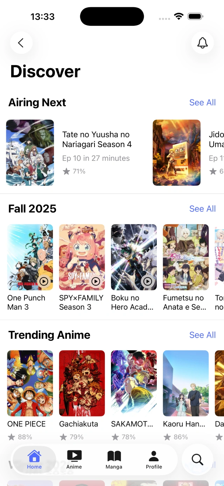
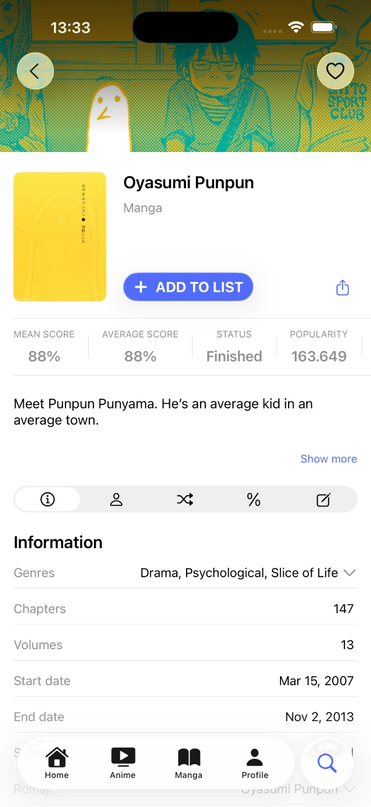
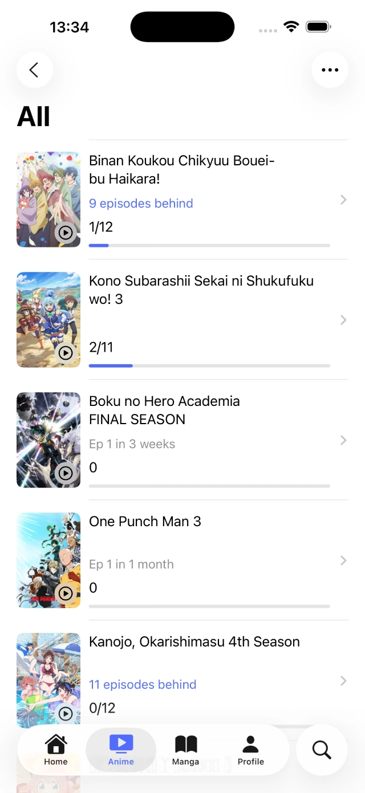

# AniHyou iOS Builder

Automated CI/CD builder and release pipeline for [AniHyou iOS](https://github.com/axiel7/AniHyou-iOS) — an open-source, modern AniList client for iOS and watchOS.

This build is distributed by a third party not related to axiel7/anihyou

---

## 📱 About AniHyou

AniHyou is a native, feature-rich AniList client built with Swift and SwiftUI.

### Features
- ⌚️ **watchOS Support** — Native companion app for Apple Watch
- 📅 **Air Schedule & Calendar** — Airing soon, seasonal animes, and weekly calendar
- 🔥 **Trending & Discover** — Explore trending anime/manga, charts (top & popular)
- 📖 **Comprehensive Details** — Anime/Manga info, tags, characters, staff, recommendations, relations, reviews, stats
- 📝 **List Management** — Manage Anime/Manga lists (status, progress, score, dates, repeat)
- 🔍 **Global Search** — Search animes, mangas, characters, staff, studios, and users
- 👤 **User Profiles** — User activity feeds, bios, and favorites
- 🧩 **Widgets** — Airing anime widgets for iOS Home Screen & Lock Screen

---

## 🚀 Automated Builds & Releases

This repository runs an automated GitHub Actions pipeline:
- ⏰ **Scheduled Runs:** Checks upstream `axiel7/AniHyou-iOS` every 12 hours for new commits on `main`.
- ⚙️ **Manual Dispatch (`workflow_dispatch`):** Build any branch, commit SHA, or force rebuild on demand.
- 📦 **Unsigned IPAs:** Automatically extracts app marketing version, compiles with Xcode, strips signatures, and packages ready-to-sideload `.ipa` releases.

### Workflow Inputs
- `branch`: Upstream branch to build from (default: `main`).
- `commit`: Target a specific commit SHA (overrides branch head).
- `force_rebuild`: Force rebuild even if a release for that commit already exists.
- `is_prerelease`: Mark published release as pre-release.
- `anilist_client_id`: Optional custom AniList OAuth Client ID (or set `ANILIST_CLIENT_ID` repo secret).
- `mal_client_id`: Optional custom MyAnimeList Client ID (or set `MAL_CLIENT_ID` repo secret).

---

## 📥 Installation / Sideloading

Download the latest `.ipa` from the [Releases](https://github.com/) section and install via your preferred tool:

- **TrollStore** (iOS 14.0 - 17.0): Direct install with full entitlements and no expiration.
- **LiveContainer**: Run without burning an App ID limit.
- **AltStore / SideStore**: Sideload with free or paid Apple Developer account.
- **Sideloadly**: Sideload via macOS or Windows.
- **Feather / Scarlet / ESign**: On-device signing with custom certificates.

---

## 🖼️ Screenshots

| | | |
|:---:|:---:|:---:|
|  |  |  |

---

## 🔗 Links & Upstream Repository

- **Upstream Repository:** [https://github.com/axiel7/AniHyou-iOS](https://github.com/axiel7/AniHyou-iOS)
- **App Store:** [https://apps.apple.com/us/app/anihyou/id1635777325](https://apps.apple.com/us/app/anihyou/id1635777325)
- **Official TestFlight:** [https://testflight.apple.com/join/Om3OIlKd](https://testflight.apple.com/join/Om3OIlKd)
- **Upstream Developer (Axel Lopez):** [axiel7](https://github.com/axiel7)

---

## ⚖️ Disclaimer

This repository automatically compiles public upstream source code for personal sideloading and archiving purposes. No warranties are provided, and no copyrighted media is hosted directly.
